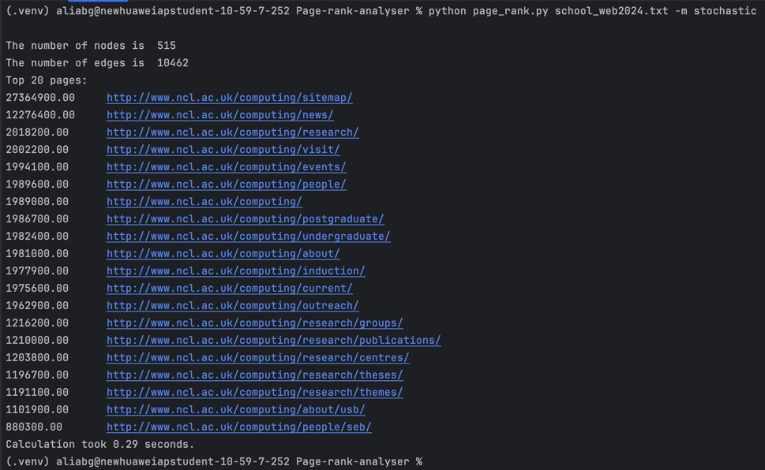

# Page-rank-analyser
================================================

Overview
========
This project is a Python implementation of the PageRank algorithm, used to evaluate the importance of web pages based
on link structure. It includes both stochastic (random walk) and probabilistic (distribution-based) estimators, and
was built as a command-line tool for analyzing large-scale web graphs efficiently.

Key learning goals included understanding graph theory, algorithm design, and performance optimisation techniques
used in large distributed systems such as search engines.

Features
========

- Implements two PageRank estimation algorithms: Stochastic and Distribution-based
- Supports multiple backends (dict-based and NetworkX-based)
- Integrated custom command-line progress bar for real-time feedback
- Optimised for large graphs through efficient random sampling and early convergence
- Modular design with clear separation of logic and execution

How to Run
==========
open the IDE terminal and copy and paste the following commands for any of the ranking methods:

python page_rank.py school_web2024.txt -m stochastic
python page_rank.py school_web2024.txt -m distribution

python page_rank_2.py school_web2024.txt -m stochastic
python page_rank_2.py school_web2024.txt -m distribution

python page_rank_optimisation.py school_web2024.txt -m stochastic
python page_rank_optimisation.py school_web2024.txt -m distribution

Example output
==============

File structure
==============

- `page_rank.py` – Main implementation using dictionaries
- `page_rank_2.py` – Alternative version using NetworkX
- `page_rank_optimisation.py` – Optimised algorithms for better performance
- `progress.py` – Reusable command-line progress bar class
- `school_web2024.txt` – Input file containing raw link data

Main file - Page_rank.py
============
This project consists of two main algorithms that estimate the pagerank of a graph of URLs from a school_web2024.txt file.
The two algorithms are:
- stochastic_page_rank which carries out a random walk starting from a random node on the graph to estimate a pagerank.
- distribution_page_rank which distributes probability for a link to be hit iteratively depending on the outgoing degree
of a node

for these two algorithms to work and function properly there are also other functions required, those being:
- load_graph which loads the graphs data from the school_web2024.txt file
- print_stats which returns the number of nodes and edges in the graph

page_rank_2.py
==============
The page_rank_2.py file is the same as page_rank.py in that it carries out the same function of creating a graph from 
data and using the two algorithms to create pagerank estimations  however instead of making use of dictionaries to
initialise and display the graph, page_rank_2.py makes use of an external library called networkx which allows for 
commands to make creating and managing a graph much easier, 

page_rank_optimisation.py
=========================
To improve the efficiency and accuracy of PageRank estimation,
several optimisations were explored. The iterative distribution_page_rank algorithm was refined
by introducing a convergence threshold, allowing the process to terminate once rank values stabilize below a defined
tolerance level, rather than running a fixed number of iterations. This reduces unnecessary computation time while
maintaining consistent results. In the stochastic_page_rank approach, performance was enhanced by caching previously
visited nodes and optimizing random walk sampling to avoid redundant transitions. These optimisations collectively make
the implementation more scalable for larger graphs while preserving the reliability of the PageRank values produced.

What I learned
==============

- Gained practical experience with graph data structures and traversal techniques
- Applied concepts from graph theory and probability to simulate real-world ranking algorithms
- Explored software design principles such as modularity, reusability, and CLI tool construction
- Practiced performance tuning for large-scale simulations

Future Improvements
===================

- Add support for damping factor (to align closer with Google's original PageRank)
- Visualise graph structure and rank using matplotlib or NetworkX
- Create a web UI to upload datasets and view ranked results interactively

